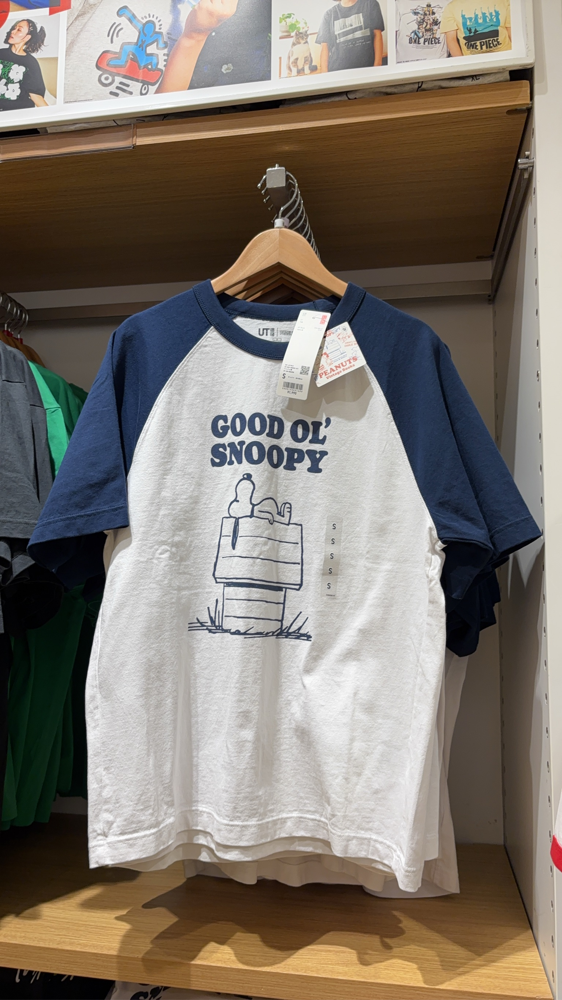

:::caution
  如果網路不夠快的話，可能會需要一段時間才能載入圖片。在此之前圖片的佈局可能會有點奇怪。
:::

## 東京行流水帳（上）

週四一大早到了東京。此行的名目是畢業旅行（雖然畢不了業😅）。

當天中午吃了 HARBS 上野店，我點了午間套餐，除了標配的沙拉，我選了某種蕃茄海鮮義大利麵、生乳酪蛋糕、柳丁汁。義大利麵體還不錯，不過真的是日式風味。生乳酪蛋糕質地很奇怪，感覺是冰箱不冰，導致蛋糕體非常軟爛。柳丁汁就是柳丁汁。同行者普遍都不太滿意。

用完午餐步行一段路到 SHI-TEN coffee，不過咖啡非常難喝。本來想轉往另一家咖啡店，結果向隅。後來步行到附近的東京大學，稍微參觀了校園裡的一些建築與紀念品商店。傍晚逛了上野的 Uniqlo 和 GU，價格真顯著地比臺灣便宜，還看到一款跟 KM 同款的 Snoopy T 恤。晚餐在上野車站附近吃了豬排飯，像是路邊的小店，但是豬排意外地嫩，就是店裡熱了點，可以說是便宜實惠。

晚上在步行回住處時買了牛肉與沖泡式的臺灣滷肉飯想要嚐鮮。這裡所謂和牛滷肉飯，即是想辦法把牛肉弄熟以後拌入飯中（與通常的用法不同）。不出意料地挺難吃的，米飯稱不上糟糕，但卻有一種奇怪的彈性。朋友說這讓他想到南部粽。雖然我更喜歡北部粽，但這真是南部粽被黑的最慘的一次。

---

週五一早參觀東京国立博物館。只可惜我看不太懂它的藏品，感覺多僅是一些老東西，而看得懂的部分又覺得普通，不如臺北故宮。按理說東京国立博物館有很多很不錯的藏品，例如定武蘭亭，^[相傳由歐陽詢臨寫的蘭亭序的石刻所拓，現存獨孤本殘片和吳炳藏本兩本。其中，趙孟頫特別喜歡獨孤本，反覆臨摹並寫有跋文《蘭亭十三跋》。] 但是都沒有展出。少數比較可觀的大概是一件汝窯藏品。我們順道參觀了一旁的黑田先生紀念館。

中午在銀座的佐藤養助吃了烏龍沾麵，其中最讓我印象深刻的是茄子天婦羅非常多汁。然後在路邊的銀座千疋屋外帶了栗子蛋糕，並搭車到國會議事堂參加提供給外國人的英語導覽。導覽從議場本體開始，到御休所（天皇休息的地方），經過各黨派的辦公室，最後到中央大廳。話說國會議事堂在明治維新早期就開始計劃建設，大概是受到西方建築的新古典主義影響，有很多復古的特徵，但又有日本特色，如中央大廳的天井四周的四幅油畫，分別描繪日本的春夏秋冬四季景色。

導覽結束後在附近的百貨公司內吃了茶寮都路里的抹茶冰淇淋，裡頭有碎冰，味道不怎好。晚餐在東京車站內的連鎖牛舌店吃了牛舌定食，同樣是便宜實惠。

---

週六一早隨朋友在清澄白河一帶吃麵包、喝咖啡。先去了 B² ビースクエアード，我點了一款上面放著馬鈴薯、雞肉和蕃茄的法棍麵包和一杯拿鐵。然後去了 Boulangerie S.Igarashi，大排長龍，我外帶了一款包著藍莓和奶油的麵包和一款包著火腿和奶油的麵包。麵包蠻好吃，朋友覺得是這趟旅行中最好吃的東西。

我們去了東京現代美術館，正在展出 30 週年特展，回顧 1935 年至 2025 年的藝術作品，展示日本現代藝術的演變與發展。不過大部分的展區都不能拍照。展覽結束後在附近的餐廳吃了釜飯。釜飯上頭有海瓜子和鴻禧菇（剛好是我喜歡的配料），只可惜味道有點單調。飯後我們在附近的街區閑晃，又逛了清澄庭園，這是一座典型的日本迴遊式庭園，環境舒適，只是天氣真的太熱了。因為朋友想吃洋食，晚餐在淺草吃了洋食 ヨシカミ，這是一家有百年歷史的名店，內部空間擁擠，到處擺滿名人來訪留下的簽名。我看了 Google 評論點了炸蝦天婦羅，雖然蝦肉緊實，但還是讓我聞到藥水味。同行者分別點了義大利麵和漢堡排，評價也都平平。總而言之這家餐廳有點過譽了。

晚餐後在淺草一帶閑晃，經過雷門與淺草寺。說實在這些景點令人感覺只是以歷史文化為名的觀光區域，街道上的商店也都只是販賣沒有特色的、批量生產的商品和食物，讓人感覺很不真誠，並不是很吸引我。我們又在附近的酒吧喝了酒。有趣的是老闆提供的下酒菜是大蔥、紅蘿蔔和小黃瓜。雖然 Google 評論很好看，但作為不太懂酒的人，只覺得那空間很熱，冷氣不夠涼，而且我點的 craft beer 味道普通，價格也不便宜。事後，朋友也說他覺得酒吧老闆不太懂酒、沒什麼熱情。在回住處的路上，我們在超市買了一些特價的熟食，回住處當宵夜吃。

## 研究與閱讀

### García-Miralles and Leganza (2024)

這篇標題是 Joint Retirement of Couples:Evidence from Discontinuities in Denmark，發表在 JPubE，作者利用丹麥全國的行政資料，研究夫妻共同退休的現象與原因。有另一篇 Coyne et al. (2024) 在 AER 也有一篇文章利用了類似的研究設計。

丹麥的公共退休金制度中，最多勞工參與的莫過於 Voluntary Early Retirement Pension (VERP)。為了領取 VEPR 提供的退休金，勞工在 60 歲之前必須受僱、積極求職。若個人在達到 VERP 資格年齡前退出勞動市場，可能會損失 5 年的福利；個人可以選擇延遲領取，但延遲領取一年就意味著損失一年的福利；並且，如果個人在領取 VERP 福利的同時仍有勞動市場收入，他們的福利金將幾乎被取消，這強烈地不鼓勵個人在領取 VERP 福利後繼續工作。在主要分析期間（1991-2013年），VERP 的資格年齡一直穩定在 60 歲。

首先，為了識別獲得 VERP 資格對於個人的影響，作者適配了以下的分段線性模型：
$$
\begin{align*}
y_{it} &= \alpha + \beta_1 (\mathit{age}_{it} - 60) + \beta_2 \{\mathit{age}_{it} \geq 60\} \\
&\quad + \beta_3 \mathbf{1}\{\mathit{age}_{it} \geq 60\} \cdot (\mathit{age}_{it} - 60) + \sum_{c = 1991}^{2013} \kappa_c D_c + \varepsilon_{it},
\end{align*}
$$
其中 $y_{it}$ 是個人 $i$ 在時間 $t$ 的結果變數，例如退休、領取養老金或收入；$\mathit{age}_{it}$ 是個人 $i$ 在日曆年年底時的月齡（monthly age）；$(\mathit{age}_{it} - 60)$ 是線性年齡趨勢項，以 60 歲為中心點，所以 $\beta_1$ 捕捉 60 歲以下年齡與結果變數的關係；$\mathbf{1}\{\mathit{age}_{it} \geq 60\}$ 在年齡超過 60 時等於 $1$，否則為 $0$，所以 $\beta_2$​ 測量在 60 歲處的不連續跳躍，即捕捉所有在一年內某個時點滿60歲者的水平跳躍，而 $\beta_3$ 則衡量 60 歲後與 60 歲前的斜率差異，反映那些更早滿60歲（更長暴露期）的額外效果；$D_c$ 則是日曆年的虛擬變數。

注意這裡的資料是以年為單位的，但是年齡則是以月計算。在年初滿 60 歲的人，在整個日曆年都有福利資格，所以他們經歷了對福利資格的「完全暴露」，而作者關心的即是完全暴露於養老金資格一整個日曆年的效果，所以他們定義完全暴露效果是 $\beta_2 + \frac{11}{12} \beta_3$。

結果發現，在個人獲得 VEPR 領取資格時，退休的機率多出 20%，並且約有 35% 的人在符合早期退休金資格的第一年結束前申領了 VERP，而曝露於退休金資格一年後，年度收入減少了 8642 美元。這說明 VEPR 對個人的退休行為有很強的 first-stage 效果。

為了分析配偶的退休行為，作者適配以下的迴歸模型：
$$
y_{it}^s = \alpha + \sum_{a = 49}^{69} \delta_{a} \cdot D_a^s + \sum_{a = 49}^{69} \gamma_a \cdot D_a^s \cdot D_g + \sum_{c = 1991}^{2013} \kappa_c \cdot D_c + \varepsilon_{it},
$$
其中，$y_{it}^s$ 表示個人 $i$ 在時間 $t$ 的配偶 $s$ 的結果變數，$D_a^s$ 是一系列配偶月齡的虛擬變數，$D_g$ 是性別虛擬變數，而 $D_c$ 是日曆年虛擬變數。這個迴歸模型的殘差代表了配偶的退休行為，但排除了他們自身年齡和性別的影響。由圖形發現，人的退休行為在伴侶達到領取退休金的資格時，出現了不連續的變化。

為了進一步量化伴侶的退休對個人的退休行為的影響，作者適配了以下的分段線性模型：
$$
\begin{align*}
y_{it}^s &= \alpha + \beta_1 (\mathit{age}_{it} - 60) + \beta_2 \mathbf{1}\{ \mathit{age}_{it} \geq 60 \} \\
&\quad + \beta_3 \mathbf{1}\{ \mathit{age}_{it} \geq 60 \} \cdot (\mathit{age}_{it} - 60) + \sum_{a = 49}^{69} \delta_{a} \cdot D_a^s + \sum_{a = 49}^{69} \gamma_a \cdot D_a^s \cdot D_g \\
&\quad + \sum_{c = 1991}^{2013} \kappa_c \cdot D_c + \varepsilon_{it},
\end{align*}
$$
其中 $\beta_2$ 衡量的是當個人月齡達到 60 歲時，所引發的伴侶的結果變數的不連續跳躍，而 $\beta_3$ 則補貼達到 60 歲之後的差異趨勢。同樣地，作者定義完全暴露效果是 $\beta_2 + \frac{11}{12} \beta_3$，這是個人獲得 VEPR 資格對於配偶退休行為的效果，稱之為 reduced-form 效果。

因此，作者將 reduced-form 除以 first-stage，得到他們稱之為 scaled effects 的數字，用以衡量個人達到退休金資格對配偶的退休行為的影響。其中，退休的 scaled effect 為 7.5%，即當有 100 名個體在獲得 VEPR 資格時選擇退休，大約有 8 名他們的配偶也會因此調整行為並同時退休；申領福利的效果為 3.4%；收入的效果是 9.8%。作者認為伴侶的其中一方達到退休金資格，對其配偶的退休決策有重要的影響。

（懶得繼續寫了）

我在想的是到底如何適當地結合 panel data 與 regression discontinuity 的方法（很懷疑這篇的設計）。

## 其他

:::books
AdaBoost 是一種集成學習（ensemble learning）的分類方法。給定一組訓練樣本，一開始每個樣本有相同的權重。然後，對於每一輪迭代：

1. 使用當前樣本權重訓練一個弱分類器。

2. 計算誤分類率，並更新樣本權重。粗略地說，對於正確分類的樣本，權重減少；對於錯誤分類的樣本，權重增加。

最後，將所有弱分類器組合成最終的分類器。
:::

突然發現我在學習如何與他人相處的過程，無意識地類似於 Adaboost。

就像 Adaboost 一開始給每個樣本相同的權重，我一開始與人互動時，使用一套（我心目中）普遍被認為合宜的方式。

但隨後在我的生命裡，我發現一些我喜歡的人、與我親近的人，對這些方式反應不佳，就像分類器對某些樣本錯誤分類。這些人就像 Adaboost 中被賦予較高權重的樣本，因為他們的重要性與複雜性促使我重新思考自己的與人相處的方式。

顧及他們的感受（就像想讓分類器更準確），我不自覺地調整自己應對人的方式，把注意力集中在那些難以應對、卻對我很重要的對象身上，這很像重新訓練下一個弱分類器，把重點放在「被錯誤分類」的部分。

但截至目前，這個無意識的學習方式並不是很成功，不像 Adaboost 一樣。照理來說，經過反覆的調整、學習和集成，我應對人的方式應該要變得更有層次、更細緻。

畢竟我對 Adaboost 的了解也僅限於課堂上聽過，並不熟悉他的理論和實踐性質，不過我猜失效的原因包括但不限於此：

1. 迭代次數太少，還沒有成功收斂（整體來說還是太少跟人相處了，因此終究沒有成功學會）。

2. 我用錯誤的方式調整權重，但這是我不能解決的，我畢竟不是電腦。

3. 我可能就像 Adaboost 可能對離群值過於敏感，過於關注難分類的樣本。