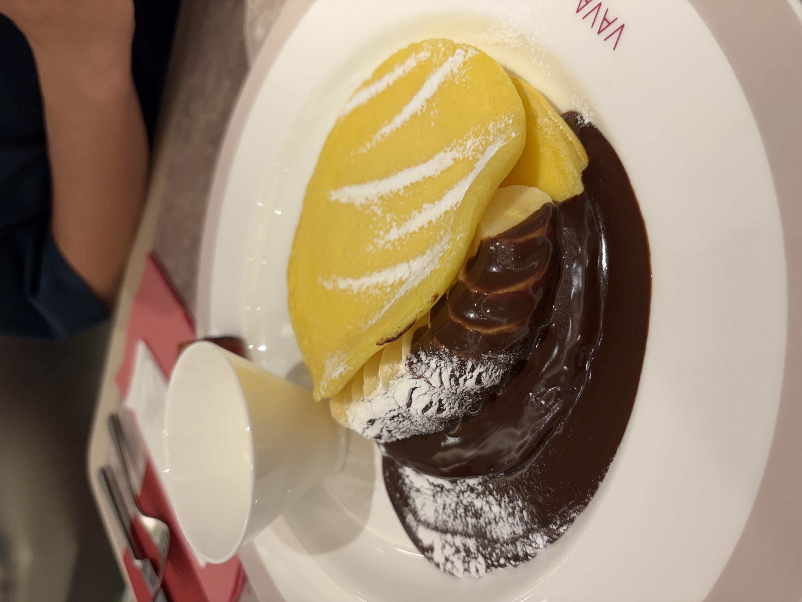
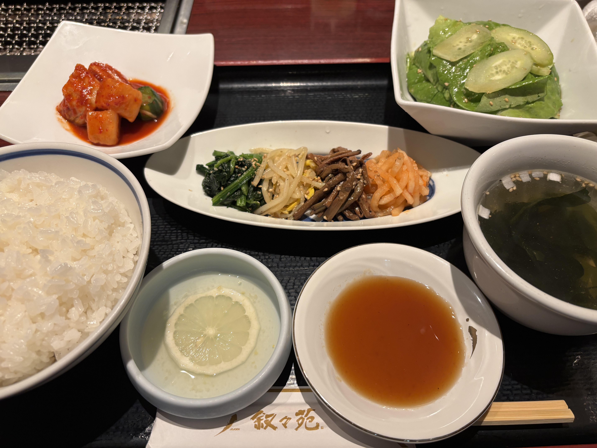
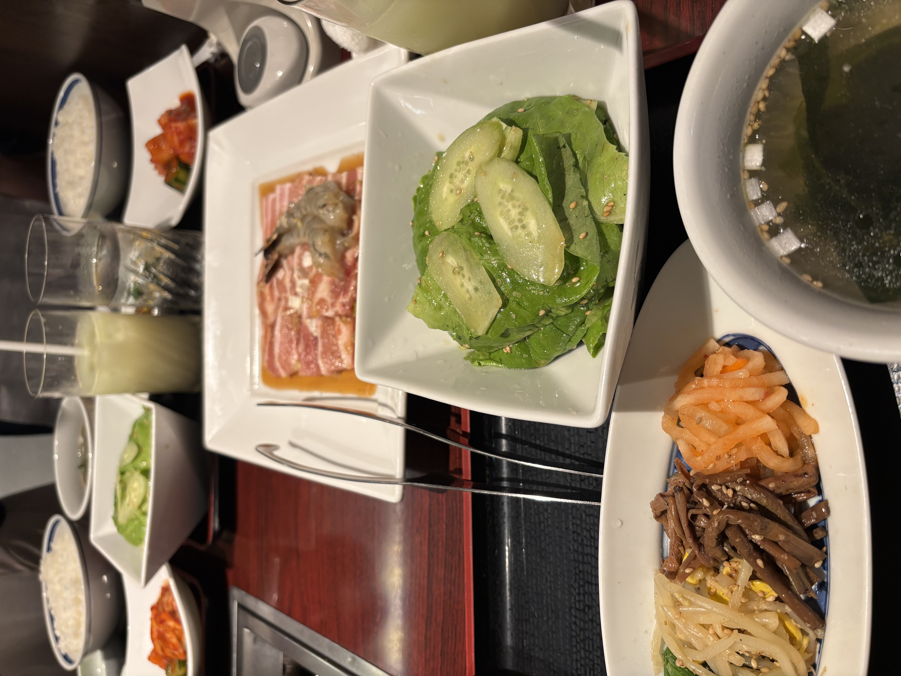
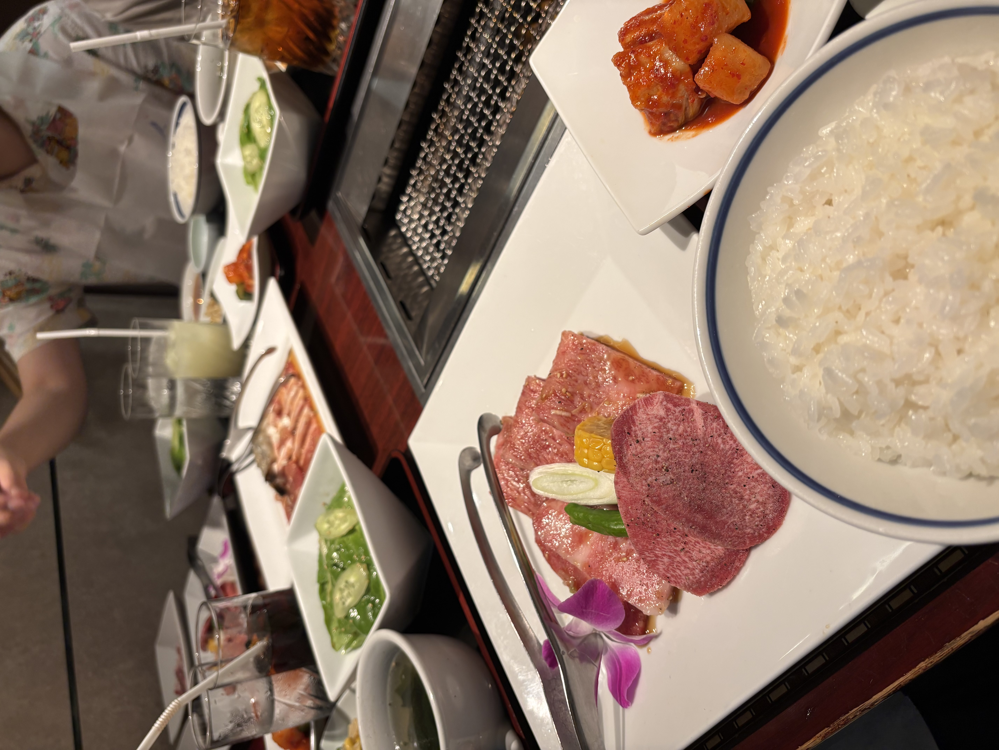
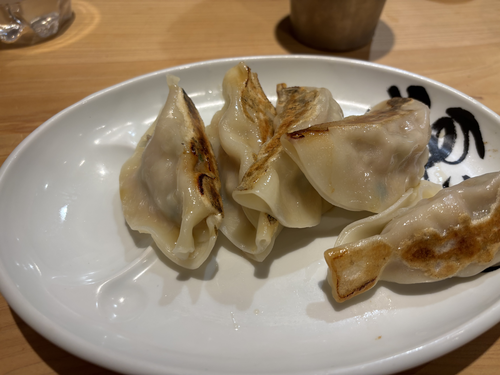
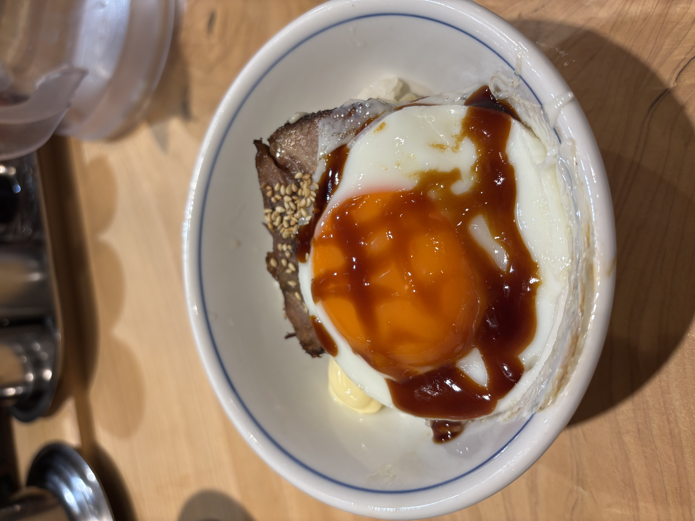

:::caution
  如果網路不夠快的話，可能會需要一段時間才能載入圖片。在此之前圖片的佈局可能會有點奇怪。
:::

## 東京行流水帳（下）

週日一早與朋友前往探訪著名的尾花鰻魚飯，雖然提早一小時抵達，但因午間時段僅接待 15 位客人，最終只能敗興而歸。事後回想，這似乎也不算太令人沮喪，畢竟Google 評論中有不少人指出尾花的品質已大不如前，甚至有人批評其服務態度欠佳。

隨後我們轉往日本橋高島屋的「特別食堂」中的野田岩。現場同樣需要排隊，不過只需留下聯絡方式即可。等待期間，我們先在高島屋的 Cafe VAVA 點了泡芙和巧克力香蕉鬆餅填填肚子。這家店的奶油相當出色。有趣的是，除了義大利麵外，幾乎所有餐點都是無麩質的米粉製品，因此泡芙和鬆餅的質地都偏向鬆軟。由於泡芙直接裹著奶油，米味並不明顯；但鬆餅的米香就較為突出，入口瞬間讓我聯想到某種台灣傳統的在來米粉煎餅。不過就是真不像鬆餅。

享用完甜點後，我們很快就回到野田岩品嚐鰻魚飯。據說這家店使用的是野生鰻魚，或許正因如此，鰻魚肉質變異較大：其中一片明顯油脂豐富，口感鬆軟；另一片則較為緊實。整體而言，火候掌控和醬汁調味都相當到位，堪稱此次旅行中最美味的一餐。此外，店家提供的筷枕是鰻魚造型，挺可愛的。

下午到了靖國神社。穿過青銅鳥居和神門後，神社本體就映入眼簾。各種銅像、紀念碑散落在神社四周。其中，特攻勇士之像紀念在二戰期間自殺性攻擊中犧牲的特攻隊員，下方並有碑文紀錄他們的事蹟。令人難以恭維的是，這些特攻隊員的事蹟被描述得相當光榮，甚至把這一切說成是日本現在和平繁榮的基礎。因為天氣實在酷熱難耐，我們在外圍走了幾圈後便進入遊就館避暑。^[遊就館的命名來自《荀子・勸學》的「故君子居必擇鄉，遊必就士」，意指君子居住必須選擇合適的鄉里，交遊必須接近賢士。] 遊就館是一座軍事博物館，裡面展示二戰期間的軍事文物，如零式戰鬥機、蒸氣火車等。館內還有紀念品商店，也很不得了，許多紀念品赤裸地呈現當時的政治宣傳以及時人的價值觀，包括戰時的國民教育課本，以及在遠東軍事法庭被判處死刑的戰犯的遺書。這些遺書內容各異，其中一篇給我留下深刻印象：作者向各界（包括他所稱的「蔣主席」）道歉卻堅不認罪，直到生命最後一刻仍堅持自己的死亡純屬政治需要。好吧，這種「忠實呈現」確實反映了當事人的真實想法，但我認為單純的史料展示反而流於偏頗，有浪漫化、英雄化戰爭的嫌疑。當然青年面對死亡時所展現的覺悟與意志力令人敬佩，但是年輕生命的凋零事實上是軍國主義教育與政策之下的悲劇，與其說英勇，我倒覺得他們被欺騙、被利用。

我們接著到湯島聖堂，這是日本的孔廟，祭祀孔子與其高徒。據說這裡的孔子像是世界上最大的（由中華民國台北雄獅俱樂部贈送）。大成殿內外都有一個「宥坐之器」。這玩意在《荀子．宥坐》中是這樣說的：

> 孔子觀於魯桓公之廟，有欹器焉，孔子問於守廟者曰：「此為何器？」守廟者曰：「此蓋為宥坐之器，」孔子曰：「吾聞宥坐之器者，虛則欹，中則正，滿則覆。」孔子顧謂弟子曰：「注水焉。」弟子挹水而注之。中而正，滿而覆，虛而欹，孔子喟然而歎曰：「吁！惡有滿而不覆者哉！」子路曰：「敢問持滿有道乎？」孔子曰：「聰明聖知，守之以愚；功被天下，守之以讓；勇力撫世，守之以怯，富有四海，守之以謙：此所謂挹而損之之道也。」

然後我們又去了壽司郎吃壽司。說實在跟臺灣壽司郎味道差不多，但有稍微便宜一些。晚餐因為想吃鰻魚飯，但連續撲空了兩家店，最後在伊豆榮吃了鰻魚飯。同樣不錯吃，但刺挑得不如早上的野田岩乾淨，還是野田岩更好吃。

---

週一一行人到 Afuri 吃拉麵。這家店的特色是柚子鹽拉麵，湯頭清爽，而且細麵蠻有嚼勁。不過論好吃程度，臺灣也有許多不輸它的拉麵；而論價格，這家店的拉麵在日本也算偏貴。叉燒飯又比拉麵更一般一些，沒什麼記憶點。

接著我和朋友到星巴克辦公，我本來想點抹茶那提，沒想到店員好像會錯意了，而我沒有及時糾正，結果得到一杯抹茶星冰樂。喝起來跟臺灣的抹茶星冰樂差不多，但便宜一些。其實我覺得來星巴克挺有趣的，除了日本的星巴克有一些當地限定的飲料以外，坐在星巴克能直接感受到日本人的日常生活。比如說我旁邊就坐了一個女生，正在讀分子生物學，應該是正在準備考試的大學生吧。

下午我們在各間瓷器店之間穿梭。我比較有印象的是最後一家店，它展出了一些藝術家設計的瓷器，有一系列深得我心，是非常淡，甚至能夠透光的藍色。只可惜現場只有茶杯和茶具，而沒有碗盤之類更泛用的東西，猶豫了半天還是沒有買。聽說鶯歌有間店同樣展出這位藝術家的作品，但經過詢問以後發現真是臺幣當日幣來賣，價格高得離譜。

為了抵達晚餐的目的地，我們用 Uber 借了 LIME 的電動滑板車，畢竟在臺灣沒有，一開始還是感覺很新奇。不過說實在東京的交通也並不比臺灣好多少，騎電動滑板車在路上還是頗危險，所以我跟朋友決定在人行道上慢慢騎。好景不常，沒多久就被警察取締了，他們在警車上要我們靠邊停車。幸好友人能說日文，跟警察溝通以後，他們只是告誡我們不能在人行道上騎電動滑板車，並請我們出示護照，交頭接耳了一會兒，最後放我們走了。這也算是少數比較有趣的體驗。

晚餐前我還去了一趟溫蒂漢堡，點了個雞肉漢堡。價格不便宜，而且不如臺麥的勁辣雞腿堡好吃，果然退出臺灣市場是有原因的。晚餐吃了壽喜燒，因為不怎吃牛肉的原因，這算是我第一次吃壽喜燒。這間店的牛肉很嫩（是我也能入口的那種，我怕肉味，所以特別不喜歡需要不斷咀嚼的牛肉，會讓肉味充斥口腔），我能想像很多人會喜歡，只是對我來說壽喜燒好像有點太甜了。宵夜我們自己烤了鱈魚和鰤魚西京燒，味道不錯，但同樣地我好像真的沒有特別喜歡甜味的東西。

---

週二是此行的最後一天，這天我們主要的行程只有吃燒肉。朋友找了上野車站附近的敘敘苑，這是一家連鎖韓式燒肉店（真奇怪，在日本吃韓式燒肉），在網路上也算是比較知名的。但我感覺自己吃不太懂，而且臺灣應該很多價格、味道相仿的店吧，除了座位非常擁擠以外，好像沒什麼記憶點。或許這真的只是臺灣人愛來的店，我們前後幾組客人都是臺灣人。後來我們又在機場吃了餃子和叉燒飯，味道平平。在結束東京行前的半小時，朋友告訴我機場免稅店有賣我想要的耳機，價格真的不錯，於是狠下心買了。這算是日本行的小小收穫。

## 研究與學習

### Mathur, Shpitser, and VanderWeele (2025+)

這篇文章名為 A Common-Cause Principle for Eliminating Selection Bias in Causal Estimands Through Covariate Adjustment，即將刊登在 Annals of Statistics 上。研究的問題是，如果要識別（identify）平均處理效應（average treatment effect, ATE），如何透過共變量調整（covariate adjustment）來消除樣本選擇偏誤（sample selection bias）？

話說德國科學哲學家賴興巴赫（Hans Reichenbach）有一個著名的論題，稱為共同原因原則（common cause principle），即如果兩個隨機變數 $A$ 和 $Y$ 之間存在正相關，且彼此之間沒有因果關係，那麼它們必定有一個共同的原因，而控制這個共同原因就能消除 $A$ 和 $Y$ 之間的相關性。^[聰明的讀者可能發現這就是一種 causal Markov condition。] 這也是我們在做因果推論時常用的原則：盡可能地控制感興趣的處理與結果之間的共同原因。

所謂樣本選擇偏誤是指當我們對某個母體（population）的參數感興趣，但卻僅能觀察到一個子樣本（selected subsample，記作 $R=1$）並據此進行分析時，所產生的偏誤。

對於樣本選擇偏誤，作者提出的類比原則是（忽略具體的技術細節）：

> 當因果結構允許透過共變量調整消除選擇偏差時，調整結果 $Y$ 和選擇指標 $R$ 的共同原因集合，就可以消除樣本選擇偏誤。

當然，我們並不知道「因果結構是否允許透過共變量調整消除選擇偏差」，因此作者提出了兩種不可能透過共變量調整消除樣本選擇偏誤的情況：

1. Type D insufficiency：若 $R$ 和 $Y$ 之間存在直接的因果關係，無論如何調整都無法消除樣本選擇偏誤。

2. Type M insufficiency：若 $R$ 是處理 $A$ 的中介變數的後代，無論如何調整都無法消除樣本選擇偏誤。

### Mathur and Shpitser (2025)

這篇文章名為 Simple Graphical Rules for Assessing Selection Bias in General-Population and Selected-Sample Treatment Effects，刊登在 American Journal of Epidemiology 上。作者提供了簡單的圖形規則來評估和解決樣本選擇偏誤。

令 $A$ 為處理，$Y$ 為結果，$R$ 為樣本選擇指標，$Z$ 為其他不被 $A$ 影響的共變量。對於任意變數 $V$，令 $V(a)$ 為 $V$ 在干預 $A=a$ 下的值。。作者定義了三個可能感興趣的待估量：

1. 母體的平均處理效應（ATE）：$$\delta \equiv \operatorname{E}[Y(a_1) - Y(a_0) \mid Z = z]$$

2. 實際上被觀察到的樣本的平均處理效應：$$\delta_R \equiv \operatorname{E}[Y(a_1) - Y(a_0) \mid R=1, Z = z]$$

3. 淨處理差異（net treatment difference, NTD）：$$\delta_{R(a)} \equiv \operatorname{E}[Y(a_1) \mid R(a_1) = 1, Z = z] - \operatorname{E}[Y(a_0) \mid R(a_0) = 1, Z = z]$$

注意到 NTD 通常不能被解釋成因果效應，因為 $R(a_1) = 1$ 與 $R(a_0) = 1$ 通常不完全是同一群人。

一個自然而然的估計量是
$$
\Delta_R \equiv \operatorname{E}[Y \mid A = a_1, R = 1, Z = z] - \operatorname{E}[Y \mid A = a_0, R = 1, Z = z].
$$
問題在於，什麼時候 $\Delta_R$ 會等於 $\delta$、$\delta_R$ 或 $\delta_{R(a)}$？

令 $\mathcal{G}$ 為一個因果圖，而 $\mathcal{G}(a)$ 為在干預 $A=a$ 下的圖（single world intervention template, SWIT）。作者給出了以下的圖形規則：
$$
\begin{align*}
(Y(a) \perp\!\!\!\perp A \mid R(a), Z)_{\mathcal{G}(a)} \tag{C1} \\
(Y(a) \perp\!\!\!\perp R(a) \mid Z)_{\mathcal{G}(a)} \tag{C2} 
\end{align*}
$$

$(\text{C1})$ 表示在給定 $R(a)$ 和 $Z$ 時，$Y(a)$ 和 $A$ 之間沒有未阻斷的後門路徑。一個蠻值家的結果是，如果 $(\text{C1})$ 成立，則 $\Delta_R = \delta_{R(a)}$。並且，如果 $(\text{C1})$ 成立且 $R$ 不受 $A$ 影響，則 $\Delta_R = \delta_{R(a)} = \delta_R$。

$(\text{C2})$ 表示在給定 $Z$ 時，$Y(a)$ 和 $R(a)$ 之間沒有未阻斷的路徑。從 principal stratification 的角度來看，$(\text{C2})$ 幾乎意味著 principal ignorability，即 $Y(a)$ 的分布在不同的 principal strata 中是相同的。此時，自然而然地 $\delta_{R(a)} = \delta$。所以，如果 $(\text{C1})$ 和 $(\text{C2})$ 都成立，則 $\Delta_R = \delta = \delta_R = \delta_{R(a)}$。
